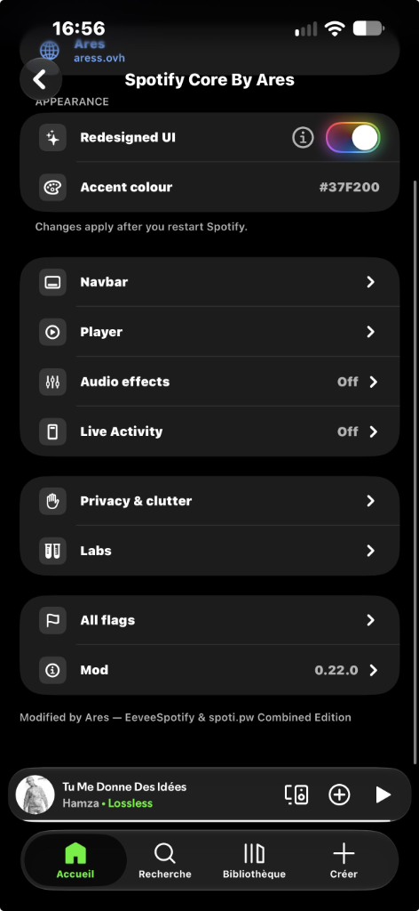
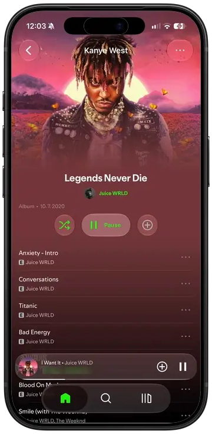
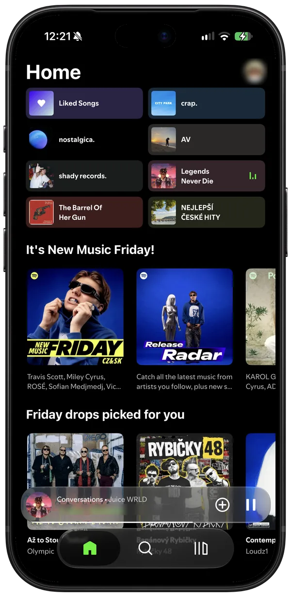
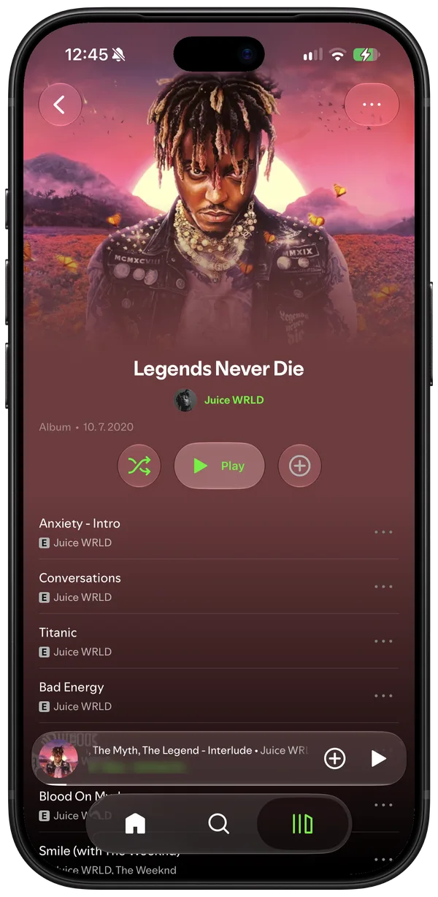
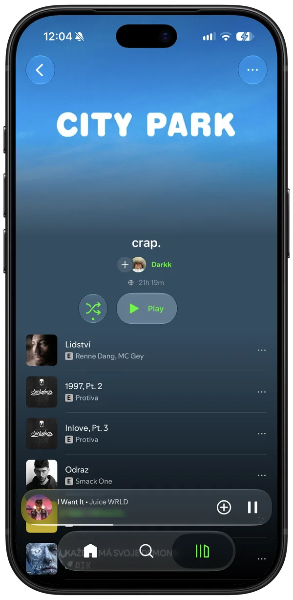
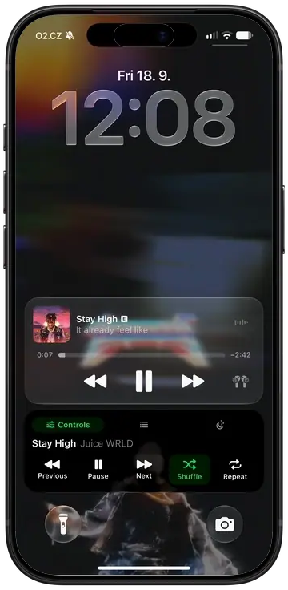

  

<h1 align="center">Spotify Core By Ares</h1>

  <b>The ultimate modded Spotify experience for iOS.</b> 
  EeveeSpotify Premium features fused with the revolutionary Liquid Glass interface, custom Ares themes, alternate icons, and audio DSP.

  
  
  

  <a href="#-previews">Screenshots</a> •
  <a href="#-whats-inside">What's Inside</a> •
  <a href="#-download">Download</a> •
  <a href="#-installation">Installation</a> •
  <a href="#-creator">Creator</a>

---

## 📸 Previews

  
  
  

  
  
  

---

## ⚡ What's Inside

Everything you want in Spotify on iOS, with zero compromises:

* **Full Premium Capabilities** — Ad-free listening, unlimited on-demand skips, highest streaming quality, and synced lyrics (powered by EeveeSpotify).
* **Liquid Glass UI & Frosted Blur** — Apple Music-inspired translucent blur and iOS 26 Liquid Glass elements, fully toggleable in settings if you prefer stock Spotify.
* **17 Custom App Icons** — Pick from 17 exclusive Ares logo editions directly from the in-app picker (*Appearance > App icon*); your Home Screen icon changes instantly.
* **Themes & Accent Colors** — Choose curated themes like *Ares Electric Purple*, *Cyberpunk Cyan*, *Sunset Crimson*, *Electric Gold*, or dial in your own custom hex color.
* **Live Creator Integration** — Real-time synced Discord profile badge in the settings footer showing live avatar and status.
* **Professional Audio DSP** — Integrated crossfeed (libbs2b) and customizable audio processing for headphones.
* **Native In-App Updater** — Spotify automatically alerts you whenever a new release drops here so you stay up-to-date.

---

## 📥 Download

Grab the latest ready-to-install `.ipa` directly from the Releases page:

👉 **[Download Latest Spotify Core By Ares IPA](https://github.com/Apnkk/Spotify-Core-Releases/releases/latest)**

---

## 📲 Installation

Compatible with any iOS 15.0+ device (iPhone & iPad).

* **TrollStore** (Recommended for iOS 14.0 – 17.0): Open the downloaded IPA in TrollStore to install with permanent signing and JIT entitlements.
* **SideStore / AltStore / Feather**: Sign with your personal Apple ID or developer certificate.
* **Sideloadly / Scarlet**: Drag & drop the `.ipa` onto your device.

---

## 👤 Creator

Crafted by **Ares** ([@xw2tt on Discord](https://discord.dog/280054039536730112))  
Combined Edition built upon EeveeSpotify & spoti.pw open-source foundations.
